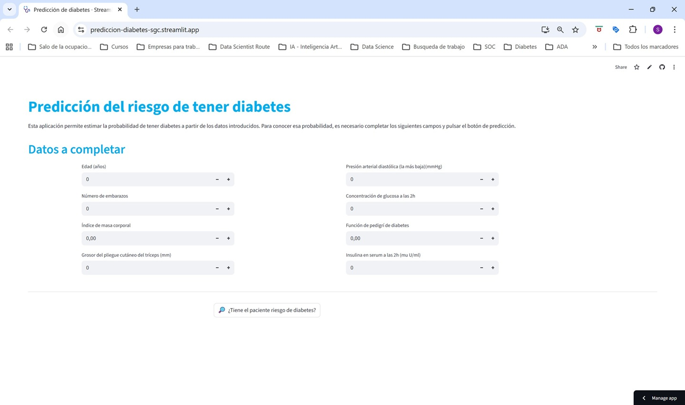
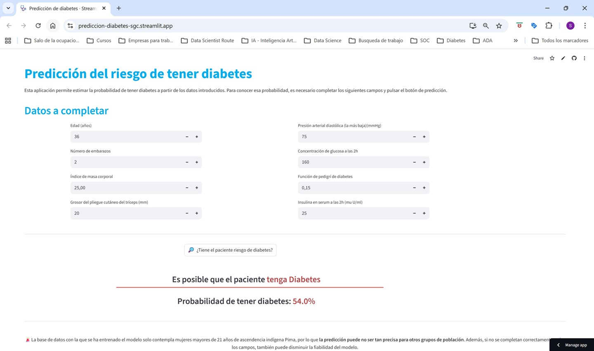
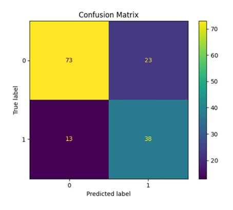

# Proyecto de Predicción de Diabetes

Este proyecto estima la probabilidad de que un paciente tenga o no diabetes a partir de una serie de variables médicas aportadas. Aplica un modelo de Machine Learning entrenado a partir de un dataset de Kaggle con [datos de mujeres de ascendencia indígena Pima](https://www.kaggle.com/datasets/uciml/pima-indians-diabetes-database/data).

## Aplicación web
Puedes probar la aplicación en el enlace siguiente:
[https://prediccion-diabetes-sgc.streamlit.app/](https://prediccion-diabetes-sgc.streamlit.app/)

## Interfaz de la aplicación
### Pantalla inicial


### Pantalla con la predicción



## Tecnologías utilizadas

- Python
- Pandas
- NumPy
- Scikit-Learn
- Plotly
- Streamlit


## Estructura del Proyecto

```
├── data/
│   ├── processed/     # Datos procesados
│   └── raw/           # Datos sin procesar
├── images/            # Imágenes para README 
├── models/            # Modelos entrenados
├── notebooks/         # Jupyter notebooks para análisis y desarrollo
├── reports/           # Informes elaborados durante el EDA
├── src/               # Código fuente de la aplicación
├── test/              # Test de diferentes procesos internos
├── app.py             # Deployment 
├── requirements.txt   # Dependencias del proyecto
└── README.md          # Este archivo
```

## Cómo ejecutar el proyecto en local

1. Clonar el proyecto
```bash
git clone https://github.com/SaraGC-Bcn/Prediccion_diabetes.git
```

2. Crear entorno virtual:
```bash
python -m venv venv
```

3. Activar el entorno virtual
```bash
source venv/bin/activate  # En macOS/Linux
```

```bash
venv\Scripts\activate     # En Windows
```

4. Instalar dependencias:
```bash
pip install -r requirements.txt
```

5. Ejecutar la aplicación:
```bash
streamlit run app.py
```

## Uso

1. El análisis exploratorio, la transformación de los datos y el desarrollo del modelo se encuentra en los notebooks, en la carpeta `notebooks/`.
1. Los modelos entrenados están guardados en la carpeta `models/`.
1. Los scripts para los pipelines y el reentreno con todos los datos originales se encuentran en la carpeta `src/`
1. La aplicación en Streamlit se encuentra en  `app.py`, directamente en la raíz del proyecto.

## Métricas
Resultados obtenidos con el modelo entrenado y el conjunto de test:
- Accuracy: 0.76
- Recall: 0.75
- Precision: 0.62
- Matriz de Confusión:




## Autor
Sara García Castañeda

Barcelona, Spain

LinkedIn: [www.linkedin.com/in/sara-garcia-castaneda](https://www.linkedin.com/in/sara-garcia-castaneda)

Github: [www.github.com/SaraGC-Bcn](https://github.com/SaraGC-Bcn)


## Licencia
MIT